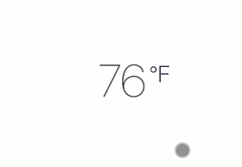

# vue-carousel-selector
a carousel selector for vuejs

## Preview

## Install
```shell
npm install --save-dev vue-carousel-selector
```
## Usage
* in your template:
```html
<carouselselector class="temp-selector-container" :options="carouseloptions" ref="carouselselector" :show="show">
    <slide v-for="(slide,i) in temperatures" :key="slide" class="temp-item" :index="i">
        {{slide}}
    </slide>
</carouselselector>
```

* in your script:

```javascript
import carouselselector from './carousel'
import slide from './slide'

...

components: {
    carouselselector,
    slide
},

data:{
    temperatures: [61, 62, 63, 64, 65, 66, 67, 68, 69, 70, 71, 72, 73, 74, 75, 76, 77, 78, 79, 80, 81, 82, 83, 84, 85, 86],

    carouseloptions:{
        vertical:true,
        num:26,  //essential
        initTZ:{ //essential,defines the height and width of the carousel panel
            width:300,
            height:200
        }
    }
}
```

* options:

```javascript
options:{
    vertical:true,//decide whether it is vertical,default is false
    num:25,//declares the length of your data array(That is the number of carousel panels)
    rtl:false,//decide whether or not to start from the left,default is false
    dtu:false,//if the direction is vertical, it decide whether or not to start from the up,default is false
    touchable:true, //decide whether it can scroll,default is true
    initTZ:{ // defines the height and width of the carousel panel
        width:300,
        height:200
    }
}

```